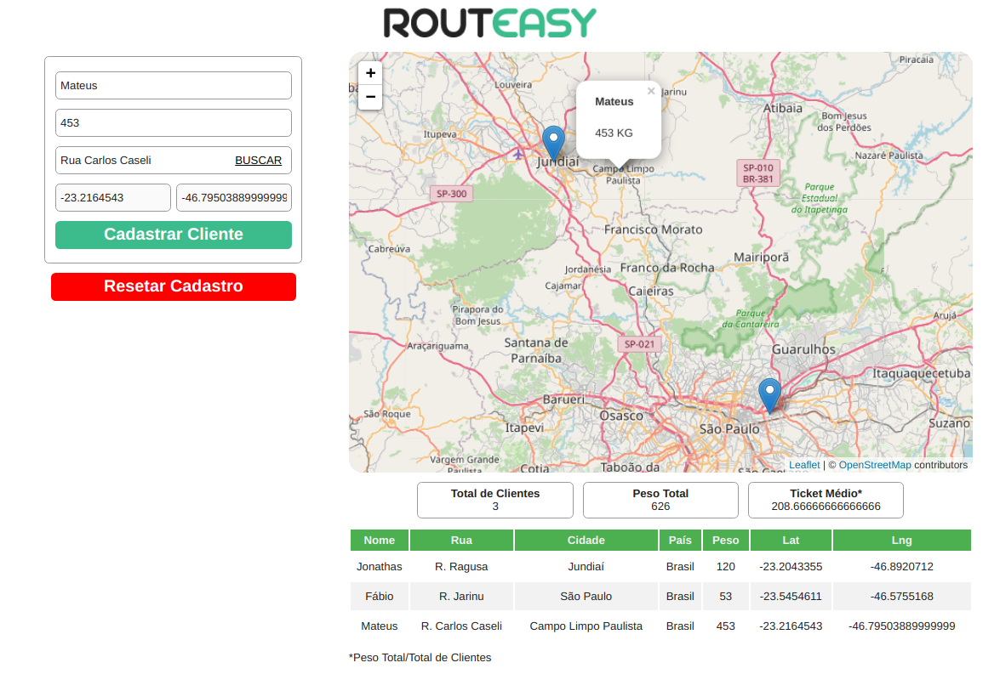

<!-- banner -->
<h1 align="center">
  
</h1>

<!-- título -->
<h1 align="center">
  Challenge para desenvolvedor Full Stack
</h1>

<!-- descrição -->
<h2 align="center">
  Pagína de Cadastro de Clientes para entrega de Produtos.
</h2>

<p align="center">
  
  <image src="https://img.shields.io/github/last-commit/jonathasribeiro/routeasy-challenge"/>
  
</p>

<!-- status -->
<p align="center"><b>Status: Concluído ✅</b></p>

---

<!-- index -->
<p align="center">
  <a href="#-sobre">Sobre</a> •
  <a href="#-tecnologias">Tecnologias</a> •
  <a href="#-executando-o-projeto">Executando o projeto</a> •
  <a href="#-licença">Licença</a>
</p>

## 🔨 Tecnologias

Estas são as principais tecnologias utilizadas na construção do projeto:

- [MongoDB](https://www.mongodb.com/)
- [Node.js](https://nodejs.org/en/)
- [ReactJS](https://reactjs.org/)
- [React Leaflet](https://react-leaflet.js.org/)
- [Google Geocode Api](https://developers.google.com/maps/documentation/geolocation/overview)

---

## 🚀 Executando o projeto

Antes de qualquer coisa, você precisa ter  o [Git](https://git-scm.com) e o [Node.js](https://nodejs.org/en/) instalado na sua máquina. Feito isso, você pode prosseguir.

### 📂 Instalando dependências

```bash
# Clone este repositório:
$ git clone https://github.com/jonathasribeiro/routeasy-challenge

# Acesse à pasta do projeto:
cd routeeasy-challenge

# Vá à pasta backend:
cd server

# Instale as depêndencias:
npm install ou yarn 

# Vá à pasta frontend:
cd ../frontend

# Instale as depêndencias:
npm install ou yarn 

# Volte à pasta do projeto:
cd ..
```

---

### 💾 Rodando o servidor (back-end)

Antes de rodar o servidor pela primeira vez, você precisa criar o banco de dados, neste caso usei o Docker para criar um Container.

```bash
# Vá à pasta backend:
cd backend

# Crie o banco de dados:
docker run --name <NOME DO BANCO> -p 27017:271017 -d -t mongo

# Abra o Arquivo .env.example e renomeie para .env

# Passe a URL do seu Banco de Dados Mongo

# Execute o server em modo de desenvolvimento:
npm run dev ou yarn dev
```

---

### 💻 Rodando a aplicação web (front-end)

Com o servidor rodando, abra um novo terminal e entre na pasta do projeto.

```bash
# Vá à pasta frontend:
cd frontend

# Execute o site em modo de desenvolvimento:
npm run start ou yarn dev
```
Caso a página não abrir automaticamente, acesse: http://localhost:3000

---


## 📋 Licença

Esse repositório está sobe a licença [MIT](https://github.com/jonathasribeiro/routeasy-challenge/blob/master/LICENSE.md).

Desenvolvido por Jonathas Ribeiro 🚀 [Entre em contato!](https://www.linkedin.com/in/jonathasribeiro151)

---